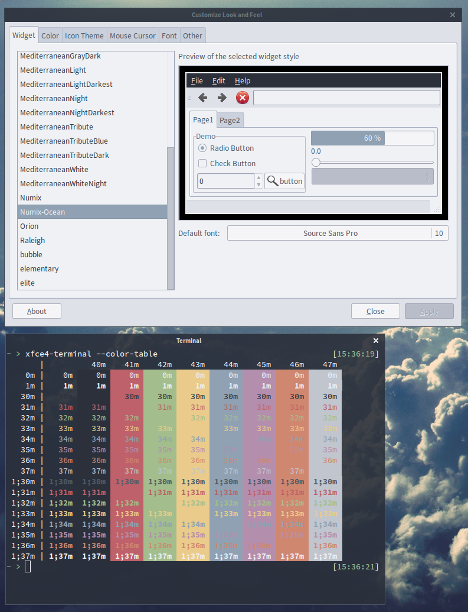

This is the excellent Numix theme, altered to use Base16 Ocean colors (see link below). It's a clean, desaturated, bluish theme.

As of right now, I've edited the GTK2, GTK3, XFWM4, and Openbox themes to use Base16 Ocean colors. The GTK3 theme contains several graphical assets which I will need to change. Then I can move on to Metacity, etc.

### Requirements

* GTK+ 3.6 or above
* Murrine theme engine

### Code, license, credits

Original [Numix Theme](https://github.com/shimmerproject/Numix)
Original [Base16 Ocean Color Scheme](http://chriskempson.github.io/base16/#ocean)

License: GPL-3.0+

### Screenshot

